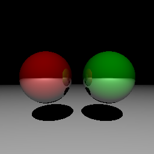

Ray tracer in Vim Script
========================
This is a ray tracer written in pure vim script.
Spheres, shadows, point lights and reflections are implemented.

Currently, the scene and image size (256x256) are hard-coded.

## Usage
1. open `tracer.vim` in Vim
2. run command `:source %`

The result will be saved into `image.ppm` as a PPM image file (P3 format).
